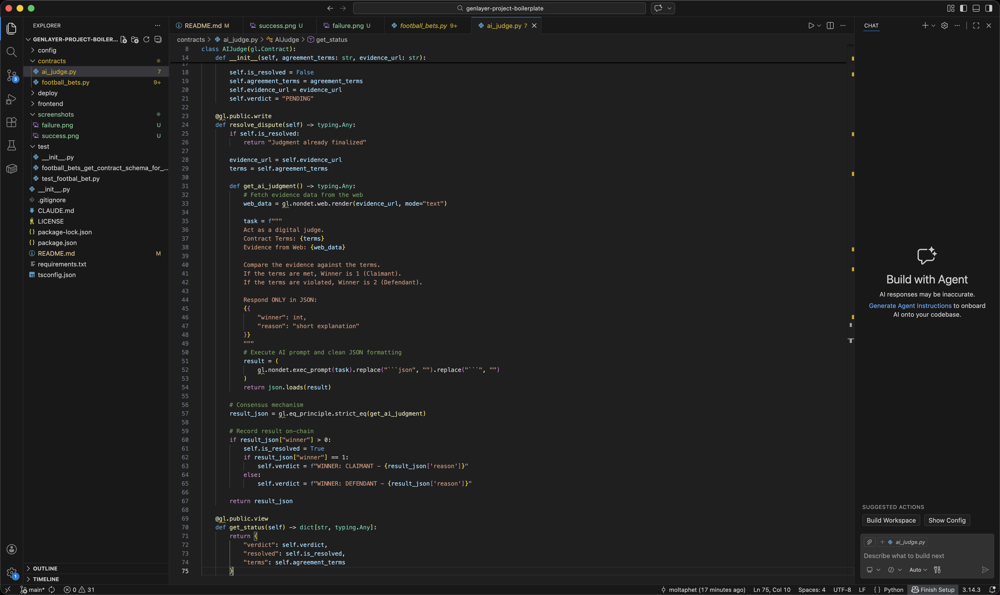
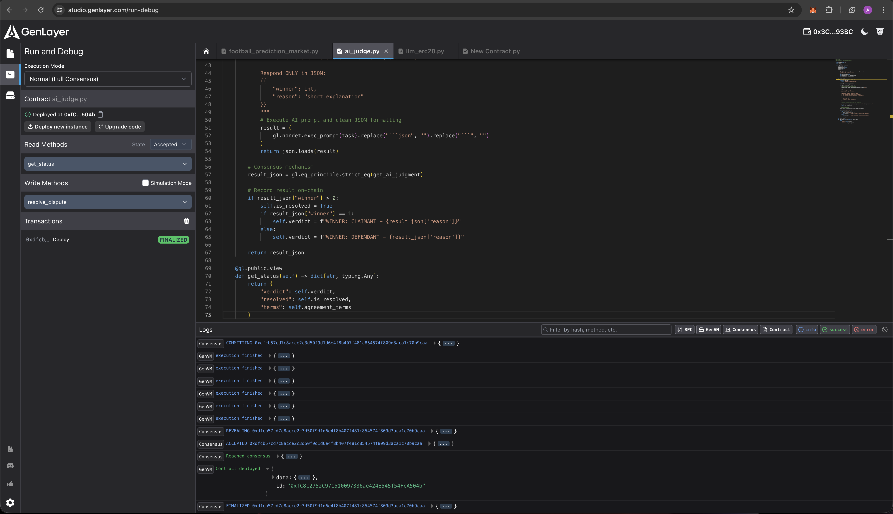
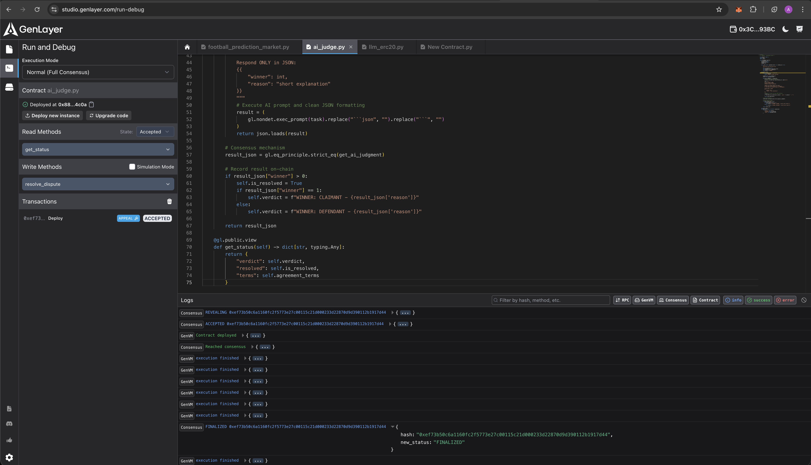

```markdown
# ⚖️ AI Judge: Decentralized Arbitration Protocol
**Building the Future of Justice on GenLayer**

---

## 🌟 Project Vision
Traditional arbitration is slow, costly, and relies on human intermediaries. **AI Judge** is a decentralized application (dApp) that automates dispute resolution using GenLayer's revolutionary **AI-Consensus**. By fetching real-world evidence directly from the web, it provides impartial, fast, and immutable verdicts.

## 🚀 Key Features
- **🌐 Web-Evidence Verification:** Uses `gl.nondet.web.render` to analyze real-time data from any URL.
- **🤖 Decentralized AI Judgment:** Leverages LLM agents that must reach consensus via the `strict_eq` principle.
- **📜 Transparent & Immutable:** Every case, evidence link, and final verdict is recorded on the GenLayer blockchain.
- **🛠 Scalable Design:** Built with the latest `py-genlayer:latest` standards for high performance.

---

## 🏗 How It Works (The Flow)
1. **Case Creation:** A user opens a dispute by providing the **Agreement Terms** and a **URL** containing the evidence.
2. **AI Analysis:** When `resolve_dispute` is called, GenLayer nodes fetch the web content.
3. **Consensus:** The AI analyzes the evidence against the terms. All validators must agree on the winner and the reasoning.
4. **Finalization:** Once finalized, the state is updated, and the judgment is issued.

---

## 📸 Proof of Execution & Testing
I have rigorously tested this contract in **GenLayer Studio** to ensure accuracy in different scenarios.

### 1. Contract Deployment
The `AIJudge` contract successfully deployed on the GenLayer Local Node.


### 2. Success Scenario (Winner: Claimant)
In this test, the AI confirmed that the terms were met based on the provided web evidence.


### 3. Failure Scenario (Winner: Defendant)
In this test, the AI detected that the terms were not fulfilled and ruled in favor of the defendant.


---

## 💻 Technical Stack
- **Framework:** GenLayer Python SDK (`py-genlayer:latest`)
- **Consensus Logic:** `gl.eq_principle.strict_eq`
- **Data Fetching:** `gl.nondet.web.render`
- **Environment:** Dockerized GenLayer Local Node

---

## 🛠 Setup & Installation
1. **Clone the repo:**
   ```bash
   git clone [https://github.com/moltaphet/genlayer-project-boilerplate.git](https://github.com/moltaphet/genlayer-project-boilerplate.git)

```

2. **Start the Node:**
```bash
docker compose up

```


3. **Interact:** Use GenLayer Studio to deploy `contracts/ai_judge.py` and start resolving disputes!

---

**Developed for the GenLayer "From Zero to GenLayer" Mission.**
*Harnessing the power of Intelligent Smart Contracts.*

```

---
